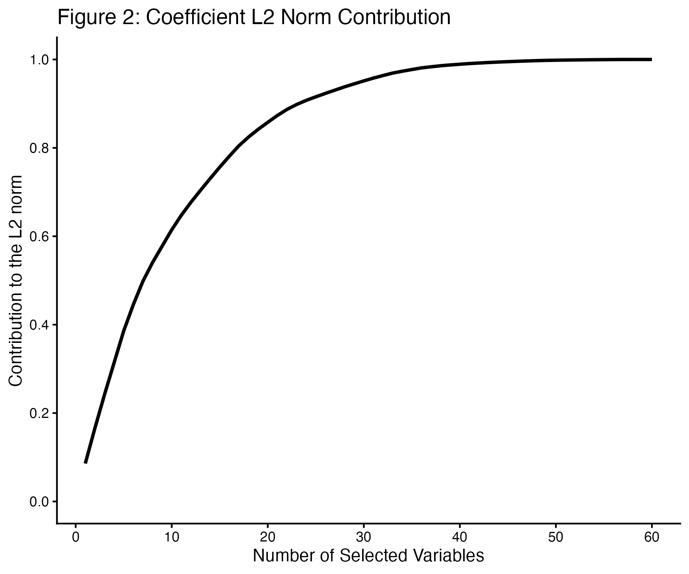
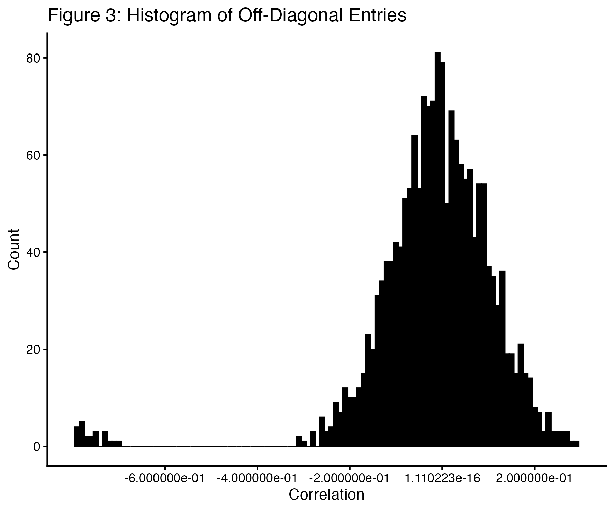
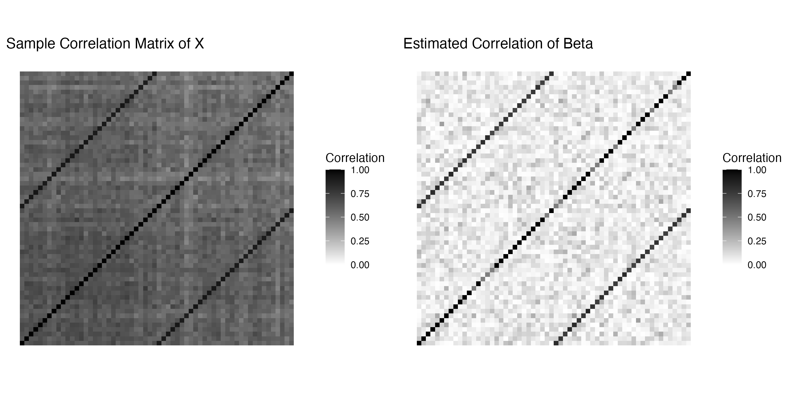
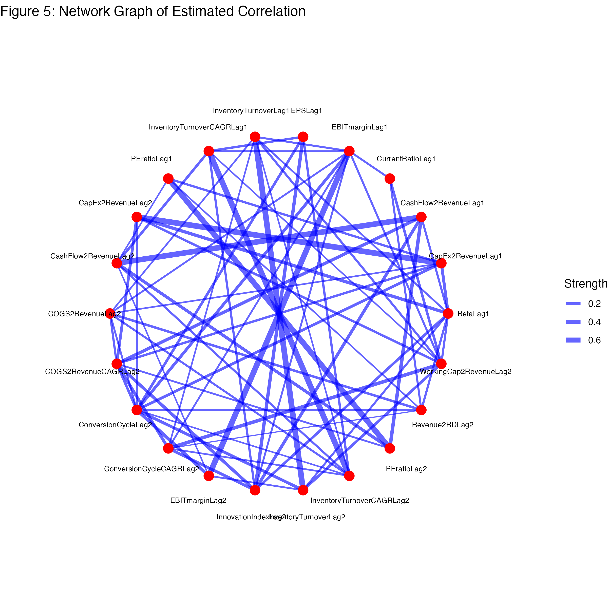

<div align="center">

# BRGL

### Bayesian Regularization via Graph Laplacian

*Pure R · Gibbs sampler · Variable selection with grouping*

[](https://www.r-project.org/)
[](LICENSE)
[](https://doi.org/10.1214/14-BA877)

</div>

---

R implementation of **Bayesian Regularization via Graph Laplacian (BRGL)** from:

> Liu F, Chakraborty S, Li F, Liu Y, Lozano AC. *Bayesian regularization via graph Laplacian.* Bayesian Analysis, 2014; 9(2):449–474.

BRGL models the dependence structure between predictors through a generalized graph Laplacian prior on the precision matrix — encouraging both sparsity and pairwise grouping of correlated variables, without inverting a covariance matrix.

---

## Model

For the linear model $y = X\beta + \epsilon$, $\epsilon \sim N(0, \sigma^2 I_n)$, BRGL places a graph Laplacian prior on $\beta$:

$$
\beta \mid \sigma^2 \sim N_p(0,\; \frac{\sigma^2}{r} \Lambda^{-1})
$$

where $\Lambda$ is the generalized graph Laplacian with diagonal entries $\Lambda_{ii} = 1 + \lambda_{ii} + \sum_{j \neq i} |\lambda_{ij}|$ and off-diagonal $\Lambda_{ij} = \lambda_{ij}$.

The hyperprior on $\lambda$ is chosen to cancel the $|\Lambda|^{1/2}$ normalizing term, yielding the closed-form marginal:

$$
\pi(\beta \mid c, r, a, b, \sigma^2) \propto \exp[ -\frac{r}{2\sigma^2} ( \sum_i \beta_i^2 + a\sigma \sum_i |\beta_i| + b\sigma \sum_{j \lt i} |\beta_i + c_{ij}\beta_j| ) ]
$$

This combines $\ell_2$ (Ridge), $\ell_1$ (Lasso), and pairwise OSCAR-like penalties in a single coherent prior.

---

## Gibbs Sampler

Parameter augmentation (introducing $\eta_{ij} = |\lambda_{ij}|$, $c_{ij} = \text{sign}(\lambda_{ij})$) yields closed-form full conditionals:

**1. Update $\sigma^2$** — Inverse-Gamma:

$$
\sigma^2 \mid \lambda, D \sim \text{Inv-Gamma}( \frac{n}{2},\; \frac{y'(I_n - X(X'X + r\Lambda)^{-1}X')y}{2} )
$$

**2. Update $\beta$** — Multivariate Normal:

$$
\beta \mid \sigma^2, \lambda, D \sim N_p( (X'X + r\Lambda)^{-1}X'y,\; \sigma^2(X'X + r\Lambda)^{-1} )
$$

**3. Update signs $c_{ij}$** — Bernoulli:

$$
P(c_{ij} = 1 \mid \beta, \sigma^2) = [ 1 + \exp( -\frac{rb(|\beta_i - \beta_j| - |\beta_i + \beta_j|)}{2\sigma} ) ]^{-1}
$$

**4. Update $\eta_{ii}$, $\eta_{ij}$** — Inverse Gaussian:

$$
\eta_{ii} \mid \beta, \sigma^2 \sim \text{Inv-Gaussian}( \frac{a\sigma}{\sqrt{r}|\beta_i|},\; a^2 )
$$

$$
\eta_{ij} \mid c, \beta, \sigma^2 \sim \text{Inv-Gaussian}( \frac{b\sigma}{\sqrt{r}|\beta_i + c_{ij}\beta_j|},\; b^2 )
$$

**5. Set** $\lambda_{ii} = \eta_{ii}$, $\lambda_{ij} = c_{ij}\eta_{ij}$, reconstruct $\Lambda$.

**6. Update hyperparameters $r, a, b$** — Gamma / Exponential:

$$
r \mid \cdot \sim \text{Gamma}( \frac{p}{2} + h_r,\; \frac{\sum_i \beta_i^2}{2\sigma^2} + \frac{a\sum_i |\beta_i|}{2\sigma} + \frac{b\sum_{j \lt i} |\beta_i + c_{ij}\beta_j|}{2\sigma} + g_r )
$$

$$
a \mid \cdot \sim \text{Exp}( g_a + \frac{r\sum_i |\beta_i|}{2\sigma} ), \qquad b \mid \cdot \sim \text{Exp}( g_b + \frac{r\sum_{j \lt i} |\beta_i + c_{ij}\beta_j|}{2\sigma} )
$$

---

## Repository Structure

```
BRGL/
├── R/
│   ├── brgl.R                 ← BRGL Gibbs sampler + auxiliary samplers
│   └── competing_methods.R    ← Lasso, EN, OSCAR, BLasso, BEN wrappers
├── simulations.R              ← 5-scenario benchmark (parallelised, 100 reps)
├── real_data_analysis.R       ← KPI dataset analysis + figures
├── test_run.R                 ← quick sanity check
├── paper.pdf                  ← original publication
├── figures/                   ← generated plots
└── results/                   ← generated tables and raw results
```

| File / Function | Description |
| :--- | :--- |
| `brgl.R` → `BRGL()` | Main Gibbs sampler |
| `brgl.R` → `rinvgauss_vectorized()` | Fast vectorised Inverse Gaussian sampler |
| `brgl.R` → `rmvnorm_robust()` | Numerically stable MVN sampler |
| `competing_methods.R` | Lasso, Elastic Net, OSCAR (FISTA+PAVA), Bayesian Lasso, Bayesian EN |

---

## Quick Start

Install dependencies once:

```r
install.packages(c("glmnet", "ggplot2", "gridExtra"))
```

```bash
Rscript test_run.R            # verify all samplers work
Rscript real_data_analysis.R  # KPI analysis → figures/
Rscript simulations.R         # 5-scenario benchmark (parallelised over 6 cores)
```

---

## Results

### Simulation Study

Five scenarios from Section 5.1 of the paper. Test MSE percentiles (10th / 50th / 90th) and median operating characteristics over 100 replications.

#### Table 3 — Test MSE (10th / 50th / 90th percentile)

| Study | BRGL | Lasso | EN | OSCAR | BLasso | BEN |
| :---: | :--- | :--- | :--- | :--- | :--- | :--- |
| 1 | 10.6 / 12.3 / 20.4 | 9.5 / 12.9 / 16.8 | 10.2 / 11.7 / 17.1 | 9.7 / 12.0 / 19.8 | 9.5 / 12.1 / 21.1 | 11.4 / 14.8 / 19.8 |
| 2 | 10.4 / 13.2 / 15.5 | 10.1 / 12.6 / 15.4 | 10.0 / 12.2 / 15.8 | 9.8 / 12.4 / 14.1 | 10.1 / 12.4 / 15.9 | 10.2 / 13.6 / 16.0 |
| 3 | 9.6 / 10.8 / 13.5 | 10.4 / 14.1 / 16.1 | 9.2 / 12.9 / 15.0 | 8.8 / 10.7 / 14.1 | 10.2 / 12.0 / 13.5 | 8.9 / 10.6 / 14.3 |
| 4 | 242.7 / 265.9 / 327.8 | 255.9 / 277.5 / 346.2 | 246.5 / 270.8 / 339.8 | 254.7 / 289.1 / 355.8 | 266.0 / 312.9 / 374.1 | 249.5 / 283.2 / 331.7 |
| 5 | 241.9 / 286.7 / 358.6 | 254.1 / 266.7 / 336.5 | 244.0 / 263.4 / 330.5 | 244.1 / 270.7 / 349.3 | 255.1 / 307.9 / 386.7 | 237.4 / 282.2 / 364.8 |

#### Table 4 — Median Operating Characteristics (%)

| Study | Method | TPR | TNR | PPV | NPV |
| :---: | :--- | :---: | :---: | :---: | :---: |
| **1** | **BRGL** | **100.0** | **90.0** | **87.5** | **100.0** |
| | Lasso | 100.0 | 50.0 | 46.4 | 100.0 |
| | EN | 100.0 | 60.0 | 55.0 | 100.0 |
| | OSCAR | 100.0 | 30.0 | 37.5 | 100.0 |
| | BLasso | 100.0 | 100.0 | 100.0 | 100.0 |
| | BEN | 83.3 | 100.0 | 100.0 | 91.7 |
| **2** | **BRGL** | **66.7** | **90.0** | **83.3** | **83.3** |
| | Lasso | 100.0 | 60.0 | 55.0 | 100.0 |
| | EN | 100.0 | 50.0 | 55.0 | 100.0 |
| | OSCAR | 100.0 | 30.0 | 43.8 | 100.0 |
| | BLasso | 66.7 | 100.0 | 100.0 | 83.3 |
| | BEN | 66.7 | 90.0 | 83.3 | 81.7 |
| **3** | **BRGL** | **56.2** | NA | **100.0** | 0.0 |
| | Lasso | 75.0 | NA | 100.0 | 0.0 |
| | EN | 87.5 | NA | 100.0 | 0.0 |
| | OSCAR | 100.0 | NA | 100.0 | 0.0 |
| | BLasso | 37.5 | NA | 100.0 | 0.0 |
| | BEN | 50.0 | NA | 100.0 | 0.0 |
| **4** | **BRGL** | **47.5** | **80.0** | **70.7** | **59.6** |
| | Lasso | 67.5 | 70.0 | 70.0 | 70.0 |
| | EN | 70.0 | 60.0 | 65.0 | 70.4 |
| | OSCAR | 65.0 | 75.0 | 72.2 | 67.4 |
| | BLasso | 45.0 | 75.0 | 69.0 | 57.0 |
| | BEN | 40.0 | 82.5 | 71.8 | 56.9 |
| **5** | **BRGL** | **76.7** | **70.0** | **59.5** | **82.2** |
| | Lasso | 73.3 | 80.0 | 67.7 | 83.3 |
| | EN | 86.7 | 70.0 | 65.1 | 90.9 |
| | OSCAR | 73.3 | 78.0 | 65.6 | 82.1 |
| | BLasso | 46.7 | 66.0 | 45.2 | 67.3 |
| | BEN | 66.7 | 74.0 | 62.7 | 79.1 |

---

### KPI Data Analysis ($n = 120$, $p = 60$)

#### Figure 2 — Coefficient Contribution to $L_2$ Norm


#### Figure 3 — Off-Diagonal Estimated Correlations


#### Figure 4 — Sample Correlation of $X$ vs. Estimated Correlation of $\beta$


#### Figure 5 — Estimated Correlation Network Graph


---

<div align="center">
<sub>Built on the methodology of Liu et al. (2014) · Bayesian Analysis · DOI: 10.1214/14-BA877</sub>
</div>
